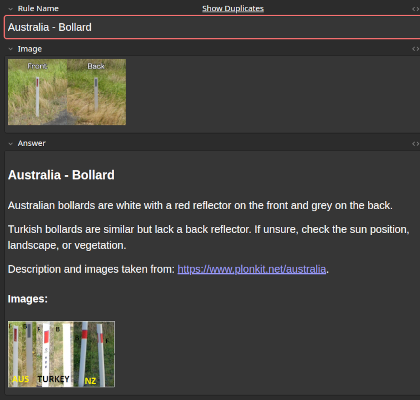

# learnable-meta Anki generator

Generate [Anki](https://apps.ankiweb.net/) decks from [Learnable Meta](https://geometa-web.pages.dev/) maps.

At the moment, the distribution license of Learnable Meta does not allow its content to be shared, so there is no Anki
deck you can just download and use.
You can, however, run this script yourself to generate the deck on your computer.

Example Anki card:



## Running the script

As a requirement, you need to have uv (https://docs.astral.sh/uv/) installed on your system. 
If you don't have uv and want to install it, you can also install Python and manually install the dependencies.
There is no easy-to-follow tutorial in this file though.

You need to download this git repository (either via `git clone` or the download button on the GitHub website).
Then, run the following code in your command line (from the geoguessr-scripts folder) to build the Anki deck.
This is written for Linux (bash); it should work on macOS, but if you are on Windows, you probably need to make some
adaptions to get it working with cmd.

```bash
uv run python3 -m learnable_meta_anki.learnablemetas
```

## Bad cards / Contribution

The script works by creating one or multiple Anki cards for each meta in a map.
For each image detected in the meta's explanation, one card is created with that image on the front and the entire
explanation on the back.

This works for most metas on the website, but for some the images contain hints to the answers, which defeats the
purpose of that card.
The file `config.json` contains a list of manual fixes.
That list is created and maintained entirely by hand, so if you encounter a card with a bad front image, create a GitHub
issue for this project, or, even better, a pull request to fix it.
